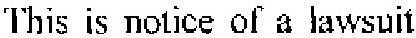
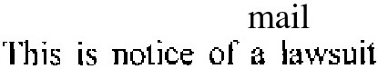
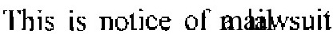
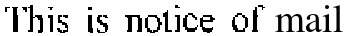
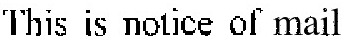
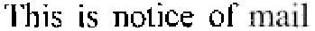
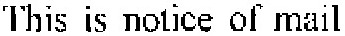
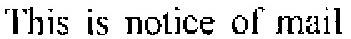

I had to replace certain sensitive data in photocopied document in
order to who these to the public.  There are popular photocopy
filters, including for gimp, but these are geared to images, not for text.
Here are what I did to achieve good
enough result so now I can show the data to different audiences.  It
is probably easy to show that part of it is cheated but that is
not the problem here.  The process is mostly the same for Gimp 2.8 and
2.10, just the pixelize pixel size calculation seem to differ.

Lets take this unpleasant text as the point of departure:  
  
It's dimension is 417x93 pixels.

1. Figure out the right font and fontsize.  The font size may differ
quite a bit from the one used in the original document as this
is a function of both original size and scan density.  In this example
case 39 points works well.  You can compare the height of "l" and
other similar letters.  Note that _FreeSerif_ fonts are quite close to _Times
New Roman_.
2. Write the text with text tool.  It allows you to correct it later
but it's a bit cumbersome.  I'd do it somewhere on the white
background, just to see if everything is right.  
  
3. Move the just created text layer in the correct place, over the
original text.  In this way you can easily see if the size is correct,
and fine-adjust it's placement:  
  
4. Delete the original text from underneath the new one.  The best way
to do this is to
select the original image layer and operate there.  

5. As the filters do not work well on text layer, you have to flatten
the image.  Converting text layers to ordinary layers will probably do
too but I did not investigate this option much.  Use the menu: _Image_ -> _Flatten image_.  The visible result
does not change.  
Now select the new text in the image and apply all the following
filters on this:
7. Add a little bit of _pick_ noise (I used 5%) to make the otherwise
identical letters
slightly different.  It is in _Filters_ -> _Noise_ -> _pick_.  Pick
swaps around colors of neighboring pixels, in my experience 5-10% pick
is a good choice:  

8. Next, pixelize the text: _Filters_ -> _blur_ -> _pixelize_.  The suitable
pixel size depends on how large are the pixels in your original text,
I used 3 points in gimp 2.8 and 2 points in gimp 2.10:  

9. Apply threshold to transform the intermittent grays into black and
white: _Colors_ -> _threshold_.  **This
is the most important step that very much determines how will your
final text look like.**  Play with the threshold value to achieve a
result that is sufficiently dark but not too dark.  I used the
threshold value 167:  

10. Finally, add some more pick noise, in order to simulate some
small-scale randomness: _Filters_ -> _Noise_ -> _pick_.  I used 5%
amount, this looks about right:  

This text looks a lot more pleasant than the original one, right?
